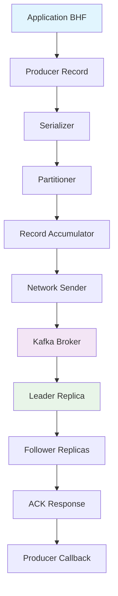
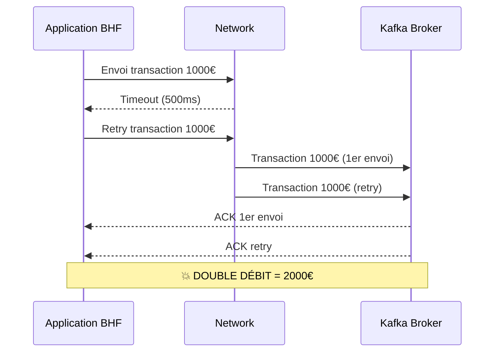

# Module 02 - Producer Idempotent (Enhanced Big Enterprise)

## 📚 Théorie (30%) - Producteur Kafka & Idempotence

### 2.1 Cycle de vie du producteur - Vue détaillée



### 2.2 Problème : Messages dupliqués - Scénario BHF détaillé

#### 🏦 **Cas réel - Double débit client**
```
Client: "J'ai payé 1000€, mais mon compte est débité de 2000€!"
Banque: "Vérification des logs Kafka..."
```

#### 📊 **Root Cause Analysis**


#### ⚠️ **Impact bancaire critique**
- **Perte financière** : Double débit = perte directe
- **Réglementaire** : Non-conformité ACPR/ECB
- **Réputation** : Perte de confiance client
- **Opérationnel** : Processus de remboursement manuel

### 2.3 Solution : Idempotence Kafka - Deep Dive

#### 🔥 **Configuration idempotent - Production BHF**
```properties
# Configuration obligatoire pour BHF
enable.idempotence=true
acks=all
retries=Integer.MAX_VALUE
max.in.flight.requests.per.connection=5

# Tuning production BHF
delivery.timeout.ms=30000
request.timeout.ms=20000
retry.backoff.ms=100
max.block.ms=60000
```

#### 🎯 **Mécanisme interne**
```mermaid
graph LR
    A[Producer ID] --> B[Sequence Number]
    B --> C[Broker State]
    C --> D[Deduplication]
    
    A1="PID:12345" --> B1="Seq:001"
    B1 --> C1["(PID:12345, Seq:001)"]
    C1 --> D1["Accept"]
    
    A2="PID:12345" --> B2="Seq:001"
    B2 --> C2["(PID:12345, Seq:001)"]
    C2 --> D2["Duplicate → Reject"]
    
    style D1 fill:#e8f5e8
    style D2 fill:#ffebee
```

---

## 🛠️ Pratique (70%) - Producer Idempotent BHF avec Spring Boot & .NET

### Workshop 02.1 - Producer Idempotent Multi-Stack

#### 🔧 **Option A : Spring Boot Java (Recommandé BHF)**

##### Étape 1 : Configuration Spring Boot

**pom.xml complet :**
```xml
<?xml version="1.0" encoding="UTF-8"?>
<project xmlns="http://maven.apache.org/POM/4.0.0" 
         xmlns:xsi="http://www.w3.org/2001/XMLSchema-instance"
         xsi:schemaLocation="http://maven.apache.org/POM/4.0.0 
         http://maven.apache.org/xsd/maven-4.0.0.xsd">
    <modelVersion>4.0.0</modelVersion>
    
    <parent>
        <groupId>org.springframework.boot</groupId>
        <artifactId>spring-boot-starter-parent</artifactId>
        <version>3.1.5</version>
        <relativePath/>
    </parent>
    
    <groupId>com.bhf.kafka</groupId>
    <artifactId>idempotent-producer-spring</artifactId>
    <version>1.0.0</version>
    <name>BHF Idempotent Producer</name>
    <description>Kafka Idempotent Producer for BHF Banking</description>
    
    <properties>
        <java.version>17</java.version>
        <kafka.version>3.4.1</kafka.version>
        <spring-kafka.version>3.0.12</spring-kafka.version>
    </properties>
    
    <dependencies>
        <!-- Spring Boot Starters -->
        <dependency>
            <groupId>org.springframework.boot</groupId>
            <artifactId>spring-boot-starter-web</artifactId>
        </dependency>
        <dependency>
            <groupId>org.springframework.boot</groupId>
            <artifactId>spring-boot-starter-actuator</artifactId>
        </dependency>
        
        <!-- Spring Kafka -->
        <dependency>
            <groupId>org.springframework.kafka</groupId>
            <artifactId>spring-kafka</artifactId>
        </dependency>
        
        <!-- Kafka Clients -->
        <dependency>
            <groupId>org.apache.kafka</groupId>
            <artifactId>kafka-clients</artifactId>
            <version>${kafka.version}</version>
        </dependency>
        
        <!-- Validation -->
        <dependency>
            <groupId>org.springframework.boot</groupId>
            <artifactId>spring-boot-starter-validation</artifactId>
        </dependency>
        
        <!-- Monitoring -->
        <dependency>
            <groupId>io.micrometer</groupId>
            <artifactId>micrometer-registry-prometheus</artifactId>
        </dependency>
        
        <!-- Testing -->
        <dependency>
            <groupId>org.springframework.boot</groupId>
            <artifactId>spring-boot-starter-test</artifactId>
            <scope>test</scope>
        </dependency>
        <dependency>
            <groupId>org.springframework.kafka</groupId>
            <artifactId>spring-kafka-test</artifactId>
            <scope>test</scope>
        </dependency>
    </dependencies>
    
    <build>
        <plugins>
            <plugin>
                <groupId>org.springframework.boot</groupId>
                <artifactId>spring-boot-maven-plugin</artifactId>
            </plugin>
        </plugins>
    </build>
</project>
```

##### Étape 2 : Configuration Application

**application.yml :**
```yaml
server:
  port: 8080

spring:
  application:
    name: bhf-idempotent-producer
  
  kafka:
    bootstrap-servers: localhost:9092
    
    producer:
      # 🔥 Configuration idempotent BHF
      key-serializer: org.apache.kafka.common.serialization.StringSerializer
      value-serializer: org.apache.kafka.common.serialization.StringSerializer
      acks: all
      retries: 2147483647  # Integer.MAX_VALUE
      max-in-flight-requests-per-connection: 5
      enable-idempotence: true
      
      # Tuning production BHF
      delivery-timeout-ms: 30000
      request-timeout-ms: 20000
      retry-backoff-ms: 100
      batch-size: 16384
      linger-ms: 5
      
      # Topics BHF
      transaction-id-prefix: bhf-txn-
      
    template:
      default-topic: bhf-transactions

# Monitoring BHF
management:
  endpoints:
    web:
      exposure:
        include: health,info,metrics,prometheus
  endpoint:
    health:
      show-details: always
  metrics:
    export:
      prometheus:
        enabled: true

# Logging BHF
logging:
  level:
    com.bhf.kafka: DEBUG
    org.springframework.kafka: INFO
    org.apache.kafka: WARN
  pattern:
    console: "%d{yyyy-MM-dd HH:mm:ss} [%thread] %-5level %logger{36} - %msg%n"
```

##### Étape 3 : Model Transaction BHF

**Transaction.java :**
```java
package com.bhf.kafka.model;

import jakarta.validation.constraints.*;
import java.math.BigDecimal;
import java.time.LocalDateTime;

public class Transaction {
    
    @NotBlank(message = "Transaction ID is required")
    private String transactionId;
    
    @NotBlank(message = "Account ID is required")
    private String accountId;
    
    @NotNull(message = "Amount is required")
    @DecimalMin(value = "0.01", message = "Amount must be positive")
    @DecimalMax(value = "999999.99", message = "Amount too large")
    private BigDecimal amount;
    
    @NotBlank(message = "Currency is required")
    @Pattern(regexp = "^[A-Z]{3}$", message = "Currency must be 3 uppercase letters")
    private String currency;
    
    @NotBlank(message = "Transaction type is required")
    private String transactionType; // DEBIT, CREDIT, TRANSFER
    
    private String status; // PENDING, COMPLETED, FAILED, REVERSED
    
    private LocalDateTime timestamp;
    
    private String description;
    
    // Constructors
    public Transaction() {
        this.timestamp = LocalDateTime.now();
        this.status = "PENDING";
    }
    
    public Transaction(String transactionId, String accountId, BigDecimal amount, 
                      String currency, String transactionType) {
        this();
        this.transactionId = transactionId;
        this.accountId = accountId;
        this.amount = amount;
        this.currency = currency;
        this.transactionType = transactionType;
    }
    
    // Getters and Setters
    public String getTransactionId() { return transactionId; }
    public void setTransactionId(String transactionId) { this.transactionId = transactionId; }
    
    public String getAccountId() { return accountId; }
    public void setAccountId(String accountId) { this.accountId = accountId; }
    
    public BigDecimal getAmount() { return amount; }
    public void setAmount(BigDecimal amount) { this.amount = amount; }
    
    public String getCurrency() { return currency; }
    public void setCurrency(String currency) { this.currency = currency; }
    
    public String getTransactionType() { return transactionType; }
    public void setTransactionType(String transactionType) { this.transactionType = transactionType; }
    
    public String getStatus() { return status; }
    public void setStatus(String status) { this.status = status; }
    
    public LocalDateTime getTimestamp() { return timestamp; }
    public void setTimestamp(LocalDateTime timestamp) { this.timestamp = timestamp; }
    
    public String getDescription() { return description; }
    public void setDescription(String description) { this.description = description; }
    
    @Override
    public String toString() {
        return String.format(
            "Transaction{id='%s', account='%s', amount=%s%s, type='%s', status='%s', time=%s}",
            transactionId, accountId, amount, currency, transactionType, status, timestamp
        );
    }
}
```

##### Étape 4 : Producer Service BHF

**TransactionProducerService.java :**
```java
package com.bhf.kafka.service;

import com.bhf.kafka.model.Transaction;
import com.fasterxml.jackson.core.JsonProcessingException;
import com.fasterxml.jackson.databind.ObjectMapper;
import org.slf4j.Logger;
import org.slf4j.LoggerFactory;
import org.springframework.beans.factory.annotation.Autowired;
import org.springframework.kafka.core.KafkaTemplate;
import org.springframework.kafka.support.SendResult;
import org.springframework.stereotype.Service;
import org.springframework.util.concurrent.ListenableFuture;
import org.springframework.util.concurrent.ListenableFutureCallback;

import java.util.UUID;

@Service
public class TransactionProducerService {
    
    private static final Logger log = LoggerFactory.getLogger(TransactionProducerService.class);
    
    @Autowired
    private KafkaTemplate<String, String> kafkaTemplate;
    
    @Autowired
    private ObjectMapper objectMapper;
    
    /**
     * 🏦 Envoi transaction BHF avec garantie idempotent
     */
    public void sendTransaction(Transaction transaction) {
        try {
            // Validation transaction
            validateTransaction(transaction);
            
            // Sérialisation JSON
            String transactionJson = objectMapper.writeValueAsString(transaction);
            
            // Clé de partitionnement basée sur le compte
            String partitionKey = transaction.getAccountId();
            
            log.info("🏦 Envoi transaction BHF : {}", transaction.getTransactionId());
            
            // Envoi asynchrone avec callback
            ListenableFuture<SendResult<String, String>> future = 
                kafkaTemplate.send("bhf-transactions", partitionKey, transactionJson);
            
            // Callback pour monitoring et erreur handling
            future.addCallback(new ListenableFutureCallback<SendResult<String, String>>() {
                @Override
                public void onSuccess(SendResult<String, String> result) {
                    log.info("✅ Transaction envoyée avec succès :");
                    log.info("   Transaction ID : {}", transaction.getTransactionId());
                    log.info("   Topic : {}", result.getRecordMetadata().topic());
                    log.info("   Partition : {}", result.getRecordMetadata().partition());
                    log.info("   Offset : {}", result.getRecordMetadata().offset());
                    log.info("   Timestamp : {}", result.getRecordMetadata().timestamp());
                    
                    // Mise à jour statut transaction
                    transaction.setStatus("COMPLETED");
                }
                
                @Override
                public void onFailure(Throwable ex) {
                    log.error("❌ Erreur lors de l'envoi de la transaction {}", transaction.getTransactionId(), ex);
                    
                    // Mise à jour statut transaction
                    transaction.setStatus("FAILED");
                    
                    // Notification monitoring BHF
                    notifyMonitoring(transaction, ex);
                }
            });
            
        } catch (JsonProcessingException e) {
            log.error("❌ Erreur de sérialisation pour transaction {}", transaction.getTransactionId(), e);
            throw new RuntimeException("Failed to serialize transaction", e);
        }
    }
    
    /**
     * 🔄 Test d'idempotence - Envoi multiple de la même transaction
     */
    public void testIdempotence(Transaction transaction, int retryCount) {
        log.info("🔄 Test d'idempotence - {} envois pour transaction {}", retryCount, transaction.getTransactionId());
        
        for (int i = 1; i <= retryCount; i++) {
            log.info("📤 Envoi {}/{}", i, retryCount);
            
            // Simulation de retry avec même transaction ID
            Transaction retryTransaction = new Transaction(
                transaction.getTransactionId(), // Même ID = même clé d'idempotence
                transaction.getAccountId(),
                transaction.getAmount(),
                transaction.getCurrency(),
                transaction.getTransactionType()
            );
            
            sendTransaction(retryTransaction);
            
            // Pause entre envois
            try {
                Thread.sleep(1000);
            } catch (InterruptedException e) {
                Thread.currentThread().interrupt();
                break;
            }
        }
    }
    
    /**
     * ✅ Validation transaction BHF
     */
    private void validateTransaction(Transaction transaction) {
        if (transaction.getTransactionId() == null || transaction.getTransactionId().trim().isEmpty()) {
            throw new IllegalArgumentException("Transaction ID cannot be null or empty");
        }
        
        if (transaction.getAmount() == null || transaction.getAmount().compareTo(BigDecimal.ZERO) <= 0) {
            throw new IllegalArgumentException("Amount must be positive");
        }
        
        if (transaction.getAccountId() == null || transaction.getAccountId().trim().isEmpty()) {
            throw new IllegalArgumentException("Account ID cannot be null or empty");
        }
        
        // Validation spécifique BHF
        if (transaction.getAmount().compareTo(new BigDecimal("100000")) > 0) {
            log.warn("⚠️ Montant élevé détecté : {} {}", transaction.getAmount(), transaction.getCurrency());
        }
    }
    
    /**
     * 📊 Notification monitoring BHF
     */
    private void notifyMonitoring(Transaction transaction, Throwable error) {
        // En production, envoyer à système de monitoring BHF
        log.error("🚨 ALERTE BHF - Erreur transaction : {} | Erreur : {}", 
                 transaction.getTransactionId(), error.getMessage());
    }
    
    /**
     * 🏦 Génération transaction de test BHF
     */
    public Transaction generateTestTransaction() {
        String transactionId = "TXN-" + UUID.randomUUID().toString().substring(0, 8).toUpperCase();
        String accountId = "ACC-" + String.format("%06d", (int)(Math.random() * 999999));
        BigDecimal amount = new BigDecimal(String.format("%.2f", 100 + Math.random() * 10000));
        
        return new Transaction(transactionId, accountId, amount, "EUR", "DEBIT");
    }
}
```

---

## 🧪 **Tests Automatisés - Self-Guided Labs**

### Test 1 : Validation Idempotence

**test-idempotence.sh :**
```bash
#!/bin/bash
echo "🏦 Test d'Idempotence BHF - Self-Guided Lab"
echo "=========================================="

# Démarrer l'application Spring Boot
echo "📦 Démarrage application Spring Boot..."
cd bhf-idempotent-producer-spring
mvn spring-boot:run &
APP_PID=$!

# Attendre démarrage
echo "⏳ Attente démarrage application..."
sleep 30

# Test 1: Envoi transaction unique
echo "📤 Test 1: Envoi transaction unique"
curl -X POST http://localhost:8080/api/v1/transactions \
  -H "Content-Type: application/json" \
  -d '{
    "transactionId": "TEST-001",
    "accountId": "ACC-123456",
    "amount": 1500.00,
    "currency": "EUR",
    "transactionType": "DEBIT",
    "description": "Test transaction unique"
  }'

sleep 2

# Test 2: Test d'idempotence (5 envois)
echo "🔄 Test 2: Test d'idempotence (5 envois)"
curl -X POST "http://localhost:8080/api/v1/transactions/test-idempotence?retryCount=5"

sleep 10

# Test 3: Vérification des messages dans Kafka
echo "🔍 Test 3: Vérification messages Kafka"
docker exec kafka kafka-console-consumer --topic bhf-transactions --bootstrap-server localhost:9092 --from-beginning --property print.key=true --timeout-ms 5000

# Nettoyage
echo "🧹 Nettoyage..."
kill $APP_PID

echo "✅ Test terminé"
```

---

## 🎯 Checkpoint Module 02 - Enhanced

### ✅ **Validation des compétences multi-stack**

#### Spring Boot Java
- [ ] Producer idempotent configuré avec `enable.idempotence=true`
- [ ] Application Spring Boot démarrée sur port 8080
- [ ] REST API `/api/v1/transactions` fonctionnelle
- [ ] Test d'idempotence via `/api/v1/transactions/test-idempotence`
- [ ] Monitoring via Actuator `/actuator/metrics`

### 📝 **Questions de checkpoint avancées**

1. **Pourquoi `max.in.flight.requests.per.connection=5` est crucial ?**
   - Garantit l'ordre des messages avec retries
   - Préserve les garanties exactly-once
   - Impact sur latence vs ordering

2. **Comment BHF monitor-t-il l'idempotence en production ?**
   - Métriques Kafka : `record-send-rate`, `record-error-rate`
   - Monitoring custom : duplicate detection rate
   - Alertes sur seuils d'erreurs

---

## 🚀 Prochain module

**Module 03** : Consumer Read-Committed - Stratégies de commit et isolation des transactions avec Spring Boot & .NET.
