# Workshop Guide - Formation Kafka Enterprise BHF

## 🎯 Objectif du Workshop

Ce guide vous permettra de réaliser **pas-à-pas** tous les modules de la formation Kafka Enterprise BHF avec des exemples concrets, des illustrations détaillées et des validations automatiques.

---

## 📋 Prérequis Workshop

### 🐧 **Ubuntu 22.04 LTS Setup**
```bash
# Installation rapide
wget https://raw.githubusercontent.com/bhf/kafka-formation/main/scripts/ubuntu-setup.sh
chmod +x ubuntu-setup.sh
./ubuntu-setup.sh

# Reconnexion nécessaire
exit && ssh user@ubuntu-server
```

### 📦 **Démarrage Cluster**
```bash
# Démarrage rapide
~/kafka-formation-bhf/scripts/quick-start.sh

# Vérification
docker ps
```

---

## 🏦 **Jour 1 - Foundations Workshop**

### Module 01 - Cluster Architecture

#### 🎯 **Objectif** : Déployer et comprendre l'architecture Kafka

#### 📊 **Architecture Visualisée**


#### 🔧 **Étapes pratiques**

**Étape 1 - Création cluster**
```bash
# Créer workspace
mkdir -p ~/kafka-workshop/day01
cd ~/kafka-workshop/day01

# Créer docker-compose.yml
cat > docker-compose.yml << 'EOF'
version: '3.8'
services:
  zookeeper:
    image: confluentinc/cp-zookeeper:7.4.0
    hostname: zookeeper
    container_name: zookeeper
    ports:
      - "2181:2181"
    environment:
      ZOOKEEPER_CLIENT_PORT: 2181
      ZOOKEEPER_TICK_TIME: 2000
    networks:
      - bhf-network

  kafka:
    image: confluentinc/cp-kafka:7.4.0
    hostname: kafka
    container_name: kafka
    depends_on:
      - zookeeper
    ports:
      - "9092:9092"
      - "29092:29092"
    environment:
      KAFKA_BROKER_ID: 1
      KAFKA_ZOOKEEPER_CONNECT: 'zookeeper:2181'
      KAFKA_LISTENER_SECURITY_PROTOCOL_MAP: PLAINTEXT:PLAINTEXT,PLAINTEXT_HOST:PLAINTEXT
      KAFKA_ADVERTISED_LISTENERS: PLAINTEXT://kafka:29092,PLAINTEXT_HOST://localhost:9092
      KAFKA_OFFSETS_TOPIC_REPLICATION_FACTOR: 1
      KAFKA_TRANSACTION_STATE_LOG_MIN_ISR: 1
      KAFKA_TRANSACTION_STATE_LOG_REPLICATION_FACTOR: 1
    networks:
      - bhf-network

networks:
  bhf-network:
    driver: bridge
EOF

# Démarrer cluster
docker-compose up -d

# Vérifier
docker ps
```

**Étape 2 - Validation cluster**
```bash
# Attendre démarrage
sleep 30

# Créer topics BHF
docker exec kafka kafka-topics --create --topic bhf-transactions --bootstrap-server localhost:9092 --partitions 3 --replication-factor 1
docker exec kafka kafka-topics --create --topic bhf-audit --bootstrap-server localhost:9092 --partitions 3 --replication-factor 1

# Lister topics
docker exec kafka kafka-topics --list --bootstrap-server localhost:9092

# Décrire topics
docker exec kafka kafka-topics --describe --topic bhf-transactions --bootstrap-server localhost:9092
```

**Étape 3 - Test production/consommation**
```bash
# Terminal 1 - Consumer
docker exec -it kafka kafka-console-consumer --topic bhf-transactions --bootstrap-server localhost:9092 --from-beginning

# Terminal 2 - Producer
docker exec -it kafka kafka-console-producer --topic bhf-transactions --bootstrap-server localhost:9092

# Envoyer messages BHF
> TXN-001:{"id":"TXN-001","amount":1500.00,"currency":"EUR","status":"COMPLETED"}
> TXN-002:{"id":"TXN-002","amount":250.50,"currency":"EUR","status":"PENDING"}
```

#### ✅ **Checkpoint Module 01**
```bash
# Script de validation automatisé
cat > validate-module-01.sh << 'EOF'
#!/bin/bash
echo "🔍 Validation Module 01 - Cluster Architecture"

# Vérifier containers
if ! docker ps | grep -q kafka; then
    echo "❌ Kafka container not running"
    exit 1
fi

if ! docker ps | grep -q zookeeper; then
    echo "❌ Zookeeper container not running"
    exit 1
fi

# Vérifier topics
if ! docker exec kafka kafka-topics --list --bootstrap-server localhost:9092 | grep -q bhf-transactions; then
    echo "❌ bhf-transactions topic not found"
    exit 1
fi

# Vérifier production/consommation
echo "📤 Test production..."
echo "test-message" | docker exec -i kafka kafka-console-producer --topic bhf-transactions --bootstrap-server localhost:9092

echo "📥 Test consommation..."
MESSAGE_COUNT=$(docker exec kafka kafka-console-consumer --topic bhf-transactions --bootstrap-server localhost:9092 --from-beginning --timeout-ms 2000 | wc -l)

if [ "$MESSAGE_COUNT" -gt 0 ]; then
    echo "✅ Module 01 validé avec succès"
    echo "   Messages reçus : $MESSAGE_COUNT"
else
    echo "❌ Aucun message reçu"
    exit 1
fi
EOF

chmod +x validate-module-01.sh
./validate-module-01.sh
```

---

### Module 02 - Producer Idempotent

#### 🎯 **Objectif** : Implémenter un producteur idempotent pour éviter les doublons

#### 📊 **Problème Illustré**

```mermaid
sequenceDiagram
    participant Client as Client BHF
    participant App as Application
    participant Network as Network
    participant Kafka as Kafka Broker
    
    Client->>App: Paiement 1000€
    App->>Network: Envoi transaction
    Network-->>App: Timeout ❌
    App->>Network: Retry transaction
    Network->>Kafka: Transaction (1er envoi)
    Network->>Kafka: Transaction (retry)
    Kafka-->>App: ACK 1er envoi
    Kafka-->>App: ACK retry
    
    Note over Client,Kafka: 💥 DOUBLE DÉBIT = 2000€
```


#### 🔧 **Étapes pratiques Spring Boot**

**Étape 1 - Création projet Spring Boot**
```bash
# Créer projet Spring Boot
cd ~/kafka-workshop/day01
mkdir bhf-producer-spring
cd bhf-producer-spring

# pom.xml
cat > pom.xml << 'EOF'
<?xml version="1.0" encoding="UTF-8"?>
<project xmlns="http://maven.apache.org/POM/4.0.0" 
         xmlns:xsi="http://www.w3.org/2001/XMLSchema-instance"
         xsi:schemaLocation="http://maven.apache.org/POM/4.0.0 
         http://maven.apache.org/xsd/maven-4.0.0.xsd">
    <modelVersion>4.0.0</modelVersion>
    
    <parent>
        <groupId>org.springframework.boot</groupId>
        <artifactId>spring-boot-starter-parent</artifactId>
        <version>3.1.5</version>
        <relativePath/>
    </parent>
    
    <groupId>com.bhf.kafka</groupId>
    <artifactId>bhf-producer-spring</artifactId>
    <version>1.0.0</version>
    
    <properties>
        <java.version>17</java.version>
    </properties>
    
    <dependencies>
        <dependency>
            <groupId>org.springframework.boot</groupId>
            <artifactId>spring-boot-starter-web</artifactId>
        </dependency>
        <dependency>
            <groupId>org.springframework.kafka</groupId>
            <artifactId>spring-kafka</artifactId>
        </dependency>
        <dependency>
            <groupId>org.springframework.boot</groupId>
            <artifactId>spring-boot-starter-validation</artifactId>
        </dependency>
    </dependencies>
    
    <build>
        <plugins>
            <plugin>
                <groupId>org.springframework.boot</groupId>
                <artifactId>spring-boot-maven-plugin</artifactId>
            </plugin>
        </plugins>
    </build>
</project>
EOF

# Structure des dossiers
mkdir -p src/main/java/com/bhf/kafka/{model,service,controller}
mkdir -p src/main/resources
```

**Étape 2 - Configuration application**
```bash
# application.yml
cat > src/main/resources/application.yml << 'EOF'
server:
  port: 8080

spring:
  application:
    name: bhf-producer-spring
  
  kafka:
    bootstrap-servers: localhost:9092
    producer:
      # 🔥 Configuration idempotent BHF
      key-serializer: org.apache.kafka.common.serialization.StringSerializer
      value-serializer: org.apache.kafka.common.serialization.StringSerializer
      acks: all
      retries: 2147483647
      max-in-flight-requests-per-connection: 5
      enable-idempotence: true
      
      # Tuning BHF
      delivery-timeout-ms: 30000
      request-timeout-ms: 20000
      retry-backoff-ms: 100

logging:
  level:
    com.bhf.kafka: DEBUG
    org.springframework.kafka: INFO
EOF
```

**Étape 3 - Model Transaction**
```bash
# Transaction.java
cat > src/main/java/com/bhf/kafka/model/Transaction.java << 'EOF'
package com.bhf.kafka.model;

import jakarta.validation.constraints.*;
import java.math.BigDecimal;
import java.time.LocalDateTime;

public class Transaction {
    @NotBlank(message = "Transaction ID is required")
    private String transactionId;
    
    @NotBlank(message = "Account ID is required")
    private String accountId;
    
    @NotNull(message = "Amount is required")
    @DecimalMin(value = "0.01", message = "Amount must be positive")
    private BigDecimal amount;
    
    @NotBlank(message = "Currency is required")
    @Pattern(regexp = "^[A-Z]{3}$", message = "Currency must be 3 uppercase letters")
    private String currency;
    
    @NotBlank(message = "Transaction type is required")
    private String transactionType;
    
    private String status;
    private LocalDateTime timestamp;
    
    public Transaction() {
        this.timestamp = LocalDateTime.now();
        this.status = "PENDING";
    }
    
    // Getters and Setters
    public String getTransactionId() { return transactionId; }
    public void setTransactionId(String transactionId) { this.transactionId = transactionId; }
    
    public String getAccountId() { return accountId; }
    public void setAccountId(String accountId) { this.accountId = accountId; }
    
    public BigDecimal getAmount() { return amount; }
    public void setAmount(BigDecimal amount) { this.amount = amount; }
    
    public String getCurrency() { return currency; }
    public void setCurrency(String currency) { this.currency = currency; }
    
    public String getTransactionType() { return transactionType; }
    public void setTransactionType(String transactionType) { this.transactionType = transactionType; }
    
    public String getStatus() { return status; }
    public void setStatus(String status) { this.status = status; }
    
    public LocalDateTime getTimestamp() { return timestamp; }
    public void setTimestamp(LocalDateTime timestamp) { this.timestamp = timestamp; }
}
EOF
```

**Étape 4 - Producer Service**
```bash
# TransactionProducerService.java
cat > src/main/java/com/bhf/kafka/service/TransactionProducerService.java << 'EOF'
package com.bhf.kafka.service;

import com.bhf.kafka.model.Transaction;
import com.fasterxml.jackson.core.JsonProcessingException;
import com.fasterxml.jackson.databind.ObjectMapper;
import org.slf4j.Logger;
import org.slf4j.LoggerFactory;
import org.springframework.kafka.core.KafkaTemplate;
import org.springframework.stereotype.Service;

import java.util.UUID;

@Service
public class TransactionProducerService {
    private static final Logger log = LoggerFactory.getLogger(TransactionProducerService.class);
    
    private final KafkaTemplate<String, String> kafkaTemplate;
    private final ObjectMapper objectMapper;
    
    public TransactionProducerService(KafkaTemplate<String, String> kafkaTemplate, ObjectMapper objectMapper) {
        this.kafkaTemplate = kafkaTemplate;
        this.objectMapper = objectMapper;
    }
    
    public void sendTransaction(Transaction transaction) {
        try {
            String transactionJson = objectMapper.writeValueAsString(transaction);
            String partitionKey = transaction.getAccountId();
            
            log.info("🏦 Envoi transaction BHF : {}", transaction.getTransactionId());
            
            kafkaTemplate.send("bhf-transactions", partitionKey, transactionJson)
                .addCallback(
                    result -> {
                        log.info("✅ Transaction envoyée avec succès : {}", transaction.getTransactionId());
                        transaction.setStatus("COMPLETED");
                    },
                    error -> {
                        log.error("❌ Erreur lors de l'envoi de la transaction {}", transaction.getTransactionId(), error);
                        transaction.setStatus("FAILED");
                    }
                );
                
        } catch (JsonProcessingException e) {
            log.error("❌ Erreur de sérialisation pour transaction {}", transaction.getTransactionId(), e);
            throw new RuntimeException("Failed to serialize transaction", e);
        }
    }
    
    public Transaction generateTestTransaction() {
        String transactionId = "TXN-" + UUID.randomUUID().toString().substring(0, 8).toUpperCase();
        String accountId = "ACC-" + String.format("%06d", (int)(Math.random() * 999999));
        BigDecimal amount = new BigDecimal(String.format("%.2f", 100 + Math.random() * 10000));
        
        return new Transaction(transactionId, accountId, amount, "EUR", "DEBIT");
    }
}
EOF
```

**Étape 5 - REST Controller**
```bash
# TransactionController.java
cat > src/main/java/com/bhf/kafka/controller/TransactionController.java << 'EOF'
package com.bhf.kafka.controller;

import com.bhf.kafka.model.Transaction;
import com.bhf.kafka.service.TransactionProducerService;
import jakarta.validation.Valid;
import org.springframework.beans.factory.annotation.Autowired;
import org.springframework.http.ResponseEntity;
import org.springframework.web.bind.annotation.*;

import java.util.HashMap;
import java.util.Map;

@RestController
@RequestMapping("/api/v1/transactions")
public class TransactionController {
    
    @Autowired
    private TransactionProducerService producerService;
    
    @PostMapping
    public ResponseEntity<Map<String, Object>> createTransaction(@Valid @RequestBody Transaction transaction) {
        producerService.sendTransaction(transaction);
        
        Map<String, Object> response = new HashMap<>();
        response.put("success", true);
        response.put("message", "Transaction envoyée avec succès");
        response.put("transactionId", transaction.getTransactionId());
        
        return ResponseEntity.ok(response);
    }
    
    @PostMapping("/test-idempotence")
    public ResponseEntity<Map<String, Object>> testIdempotence(@RequestParam(defaultValue = "3") int retryCount) {
        Transaction testTransaction = producerService.generateTestTransaction();
        
        for (int i = 1; i <= retryCount; i++) {
            producerService.sendTransaction(testTransaction);
            try {
                Thread.sleep(1000);
            } catch (InterruptedException e) {
                Thread.currentThread().interrupt();
                break;
            }
        }
        
        Map<String, Object> response = new HashMap<>();
        response.put("success", true);
        response.put("message", "Test d'idempotence lancé");
        response.put("transactionId", testTransaction.getTransactionId());
        response.put("retryCount", retryCount);
        
        return ResponseEntity.ok(response);
    }
}
EOF
```

**Étape 6 - Application Main**
```bash
# BhfProducerApplication.java
cat > src/main/java/com/bhf/kafka/BhfProducerApplication.java << 'EOF'
package com.bhf.kafka;

import org.springframework.boot.SpringApplication;
import org.springframework.boot.autoconfigure.SpringBootApplication;
import org.springframework.kafka.annotation.EnableKafka;

@SpringBootApplication
@EnableKafka
public class BhfProducerApplication {
    public static void main(String[] args) {
        SpringApplication.run(BhfProducerApplication.class, args);
    }
}
EOF
```

#### 🧪 **Tests pratiques**

**Test 1 - Démarrage application**
```bash
# Compiler et démarrer
mvn clean package
java -jar target/bhf-producer-spring-1.0.0.jar &
APP_PID=$!

# Attendre démarrage
sleep 30

# Vérifier health
curl -s http://localhost:8080/api/v1/transactions/health || echo "❌ Application not ready"
```

**Test 2 - Test d'idempotence**
```bash
# Test 1: Transaction unique
echo "📤 Test 1: Transaction unique"
curl -X POST http://localhost:8080/api/v1/transactions \
  -H "Content-Type: application/json" \
  -d '{
    "transactionId": "TEST-001",
    "accountId": "ACC-123456",
    "amount": 1500.00,
    "currency": "EUR",
    "transactionType": "DEBIT"
  }'

sleep 2

# Test 2: Test d'idempotence (3 envois)
echo "🔄 Test 2: Test d'idempotence (3 envois)"
curl -X POST "http://localhost:8080/api/v1/transactions/test-idempotence?retryCount=3"

sleep 5

# Test 3: Vérification résultats
echo "🔍 Test 3: Vérification unicité"
MESSAGE_COUNT=$(docker exec kafka kafka-console-consumer --topic bhf-transactions --bootstrap-server localhost:9092 --from-beginning --timeout-ms 5000 | grep "TEST-001" | wc -l)

if [ "$MESSAGE_COUNT" -eq 1 ]; then
    echo "✅ Test d'idempotence réussi : 1 seul message"
else
    echo "❌ Test d'idempotence échoué : $MESSAGE_COUNT messages"
fi

# Nettoyage
kill $APP_PID
```

#### ✅ **Checkpoint Module 02**
```bash
# Script de validation automatisé
cat > validate-module-02.sh << 'EOF'
#!/bin/bash
echo "🔍 Validation Module 02 - Producer Idempotent"

# Démarrer application
mvn spring-boot:run &
APP_PID=$!

# Attendre démarrage
sleep 30

# Test d'idempotence
curl -X POST "http://localhost:8080/api/v1/transactions/test-idempotence?retryCount=5" > /dev/null

# Attendre traitement
sleep 10

# Compter messages
MESSAGE_COUNT=$(docker exec kafka kafka-console-consumer --topic bhf-transactions --bootstrap-server localhost:9092 --from-beginning --timeout-ms 5000 | wc -l)

if [ "$MESSAGE_COUNT" -eq 1 ]; then
    echo "✅ Module 02 validé avec succès"
    echo "   Idempotence fonctionnelle : 1 seul message reçu"
else
    echo "❌ Module 02 échoué : $MESSAGE_COUNT messages reçus"
fi

# Nettoyage
kill $APP_PID
EOF

chmod +x validate-module-02.sh
./validate-module-02.sh
```

---

### Module 03 - Consumer Read-Committed

#### 🎯 **Objectif** : Implémenter un consumer avec isolation read_committed

#### 📊 **Isolation Illustrée**


#### 🔧 **Étapes pratiques Spring Boot Consumer**

**Étape 1 - Création projet consumer**
```bash
# Créer projet consumer
cd ~/kafka-workshop/day01
mkdir bhf-consumer-spring
cd bhf-consumer-spring

# pom.xml (similaire au producer)
cat > pom.xml << 'EOF'
<?xml version="1.0" encoding="UTF-8"?>
<project xmlns="http://maven.apache.org/POM/4.0.0" 
         xmlns:xsi="http://www.w3.org/2001/XMLSchema-instance"
         xsi:schemaLocation="http://maven.apache.org/POM/4.0.0 
         http://maven.apache.org/xsd/maven-4.0.0.xsd">
    <modelVersion>4.0.0</modelVersion>
    
    <parent>
        <groupId>org.springframework.boot</groupId>
        <artifactId>spring-boot-starter-parent</artifactId>
        <version>3.1.5</version>
        <relativePath/>
    </parent>
    
    <groupId>com.bhf.kafka</groupId>
    <artifactId>bhf-consumer-spring</artifactId>
    <version>1.0.0</version>
    
    <properties>
        <java.version>17</java.version>
    </properties>
    
    <dependencies>
        <dependency>
            <groupId>org.springframework.boot</groupId>
            <artifactId>spring-boot-starter-web</artifactId>
        </dependency>
        <dependency>
            <groupId>org.springframework.kafka</groupId>
            <artifactId>spring-kafka</artifactId>
        </dependency>
    </dependencies>
    
    <build>
        <plugins>
            <plugin>
                <groupId>org.springframework.boot</groupId>
                <artifactId>spring-boot-maven-plugin</artifactId>
            </plugin>
        </plugins>
    </build>
</project>
EOF

# Structure
mkdir -p src/main/java/com/bhf/kafka/{model,service,controller}
mkdir -p src/main/resources
```

**Étape 2 - Configuration consumer**
```bash
# application.yml
cat > src/main/resources/application.yml << 'EOF'
server:
  port: 8081

spring:
  application:
    name: bhf-consumer-spring
  
  kafka:
    bootstrap-servers: localhost:9092
    consumer:
      # 🔥 Configuration read_committed BHF
      key-deserializer: org.apache.kafka.common.serialization.StringDeserializer
      value-deserializer: org.apache.kafka.common.serialization.StringDeserializer
      group-id: bhf-transaction-processors
      auto-offset-reset: earliest
      enable-auto-commit: false
      isolation-level: read_committed
      
      # Tuning BHF
      max-poll-records: 500
      session-timeout-ms: 30000
      heartbeat-interval-ms: 10000

logging:
  level:
    com.bhf.kafka: DEBUG
    org.springframework.kafka: INFO
EOF
```

**Étape 3 - Consumer Service**
```bash
# TransactionConsumerService.java
cat > src/main/java/com/bhf/kafka/service/TransactionConsumerService.java << 'EOF'
package com.bhf.kafka.service;

import com.fasterxml.jackson.databind.ObjectMapper;
import org.slf4j.Logger;
import org.slf4j.LoggerFactory;
import org.springframework.kafka.annotation.KafkaListener;
import org.springframework.kafka.support.Acknowledgment;
import org.springframework.stereotype.Service;

import java.util.concurrent.atomic.AtomicLong;

@Service
public class TransactionConsumerService {
    private static final Logger log = LoggerFactory.getLogger(TransactionConsumerService.class);
    
    private final ObjectMapper objectMapper;
    private final AtomicLong processedCount = new AtomicLong(0);
    
    public TransactionConsumerService(ObjectMapper objectMapper) {
        this.objectMapper = objectMapper;
    }
    
    @KafkaListener(
        topics = "bhf-transactions",
        groupId = "bhf-transaction-processors"
    )
    public void processTransaction(String message, Acknowledgment acknowledgment) {
        try {
            log.info("🏦 Réception transaction BHF : {}", message);
            
            // Traitement métier
            Thread.sleep(100); // Simulation traitement
            
            // Commit manuel
            acknowledgment.acknowledge();
            
            long processed = processedCount.incrementAndGet();
            log.info("✅ Transaction traitée avec succès | Total : {}", processed);
            
        } catch (Exception e) {
            log.error("❌ Erreur traitement transaction : {}", message, e);
            acknowledgment.acknowledge(); // Éviter boucle infinie
        }
    }
    
    public long getProcessedCount() {
        return processedCount.get();
    }
}
EOF
```

**Étape 4 - Controller monitoring**
```bash
# ConsumerController.java
cat > src/main/java/com/bhf/kafka/controller/ConsumerController.java << 'EOF'
package com.bhf.kafka.controller;

import com.bhf.kafka.service.TransactionConsumerService;
import org.springframework.beans.factory.annotation.Autowired;
import org.springframework.http.ResponseEntity;
import org.springframework.web.bind.annotation.*;

import java.util.HashMap;
import java.util.Map;

@RestController
@RequestMapping("/api/v1/consumer")
public class ConsumerController {
    
    @Autowired
    private TransactionConsumerService consumerService;
    
    @GetMapping("/metrics")
    public ResponseEntity<Map<String, Object>> getMetrics() {
        Map<String, Object> metrics = new HashMap<>();
        metrics.put("processedCount", consumerService.getProcessedCount());
        metrics.put("timestamp", System.currentTimeMillis());
        
        return ResponseEntity.ok(metrics);
    }
    
    @GetMapping("/health")
    public ResponseEntity<Map<String, Object>> health() {
        Map<String, Object> health = new HashMap<>();
        health.put("status", "UP");
        health.put("service", "BHF Read-Committed Consumer");
        health.put("processedCount", consumerService.getProcessedCount());
        
        return ResponseEntity.ok(health);
    }
}
EOF
```

**Étape 5 - Application Main**
```bash
# BhfConsumerApplication.java
cat > src/main/java/com/bhf/kafka/BhfConsumerApplication.java << 'EOF'
package com.bhf.kafka;

import org.springframework.boot.SpringApplication;
import org.springframework.boot.autoconfigure.SpringBootApplication;
import org.springframework.kafka.annotation.EnableKafka;

@SpringBootApplication
@EnableKafka
public class BhfConsumerApplication {
    public static void main(String[] args) {
        SpringApplication.run(BhfConsumerApplication.class, args);
    }
}
EOF
```

#### 🧪 **Tests pratiques**

**Test 1 - Démarrage consumer**
```bash
# Démarrer consumer
mvn spring-boot:run &
CONSUMER_PID=$!

# Attendre démarrage
sleep 30

# Vérifier health
curl -s http://localhost:8081/api/v1/consumer/health
```

**Test 2 - Test read_committed**
```bash
# Envoyer transaction validée
curl -X POST http://localhost:8080/api/v1/transactions \
  -H "Content-Type: application/json" \
  -d '{
    "transactionId": "COMMITTED-001",
    "accountId": "ACC-123456",
    "amount": 1500.00,
    "currency": "EUR",
    "transactionType": "DEBIT"
  }'

sleep 3

# Vérifier métriques
curl -s http://localhost:8081/api/v1/consumer/metrics

# Nettoyage
kill $CONSUMER_PID
```

#### ✅ **Checkpoint Module 03**
```bash
# Script de validation automatisé
cat > validate-module-03.sh << 'EOF'
#!/bin/bash
echo "🔍 Validation Module 03 - Consumer Read-Committed"

# Démarrer consumer
mvn spring-boot:run &
CONSUMER_PID=$!

# Attendre démarrage
sleep 30

# Envoyer transaction
curl -X POST http://localhost:8080/api/v1/transactions \
  -H "Content-Type: application/json" \
  -d '{
    "transactionId": "VALIDATION-001",
    "accountId": "ACC-123456",
    "amount": 1500.00,
    "currency": "EUR",
    "transactionType": "DEBIT"
  }' > /dev/null

# Attendre traitement
sleep 5

# Vérifier métriques
PROCESSED_COUNT=$(curl -s http://localhost:8081/api/v1/consumer/metrics | jq -r '.processedCount')

if [ "$PROCESSED_COUNT" -gt 0 ]; then
    echo "✅ Module 03 validé avec succès"
    echo "   Transactions traitées : $PROCESSED_COUNT"
else
    echo "❌ Module 03 échoué : Aucune transaction traitée"
fi

# Nettoyage
kill $CONSUMER_PID
EOF

chmod +x validate-module-03.sh
./validate-module-03.sh
```

---

## 🏆 **Validation Complete du Jour 1**

### 📋 **Checklist finale**
```bash
# Script de validation complète du jour 1
cat > validate-day-01.sh << 'EOF'
#!/bin/bash
echo "🏆 Validation Complete - Jour 1 Foundations"

echo "📋 Validation Module 01 - Cluster Architecture"
./validate-module-01.sh
MODULE_01_RESULT=$?

echo ""
echo "📋 Validation Module 02 - Producer Idempotent"
./validate-module-02.sh
MODULE_02_RESULT=$?

echo ""
echo "📋 Validation Module 03 - Consumer Read-Committed"
./validate-module-03.sh
MODULE_03_RESULT=$?

echo ""
echo "🏆 Résultats Jour 1 :"
echo "   Module 01 (Cluster) : $([ $MODULE_01_RESULT -eq 0 ] && echo "✅ VALIDÉ" || echo "❌ ÉCHOUÉ")"
echo "   Module 02 (Producer) : $([ $MODULE_02_RESULT -eq 0 ] && echo "✅ VALIDÉ" || echo "❌ ÉCHOUÉ")"
echo "   Module 03 (Consumer) : $([ $MODULE_03_RESULT -eq 0 ] && echo "✅ VALIDÉ" || echo "❌ ÉCHOUÉ")"

if [ $MODULE_01_RESULT -eq 0 ] && [ $MODULE_02_RESULT -eq 0 ] && [ $MODULE_03_RESULT -eq 0 ]; then
    echo ""
    echo "🎉 FÉLICITATIONS ! Jour 1 complété avec succès"
    echo "🚀 Prêt pour le Jour 2 - Transactions & Exactly-Once"
else
    echo ""
    echo "⚠️ Certains modules nécessitent une attention"
    echo "📚 Veuillez consulter la documentation pour corriger les problèmes"
fi
EOF

chmod +x validate-day-01.sh
./validate-day-01.sh
```

---

## 📚 **Ressources Workshop**

### 🎯 **Guides pas-à-pas**
- **Module 01** : Architecture et déploiement cluster
- **Module 02** : Producer idempotent avec Spring Boot
- **Module 03** : Consumer read_committed avec monitoring

### 🧪 **Scripts automatisés**
- `validate-module-01.sh` - Validation cluster
- `validate-module-02.sh` - Validation producer idempotent
- `validate-module-03.sh` - Validation consumer read_committed
- `validate-day-01.sh` - Validation complète jour 1

### 📊 **Monitoring et métriques**
- Health checks : `/api/v1/transactions/health`, `/api/v1/consumer/health`
- Métriques : `/api/v1/consumer/metrics`
- Tests d'idempotence : `/api/v1/transactions/test-idempotence`

### 🏦 **Cas d'usage BHF**
- Transactions bancaires avec garantie exactly-once
- Audit trails immuables
- Monitoring temps réel
- Validation réglementaire

---

## 🚀 **Prochains modules**

**Jour 2** : Transactions & Exactly-Once
- Module 04 : Schema Registry
- Module 05 : Transactional Producer
- Module 06 : Read-Committed avancé
- Module 07 : EOS Pipeline

**Jour 3** : Streams & Production
- Module 08 : Kafka Streams
- Module 09 : Monitoring avancé
- Module 10 : Performance tuning
- Module 11 : Admin operations

---

## 🎓 **Certification Workshop**

À la fin de ce workshop, vous aurez maîtrisé :

- ✅ Architecture Kafka enterprise
- ✅ Producer idempotent avec Spring Boot
- ✅ Consumer read_committed avec monitoring
- ✅ Tests automatisés et validation
- ✅ Pratiques BHF banking

**Workshop Kafka Enterprise BHF - Ready for Production!** 🏦✅
